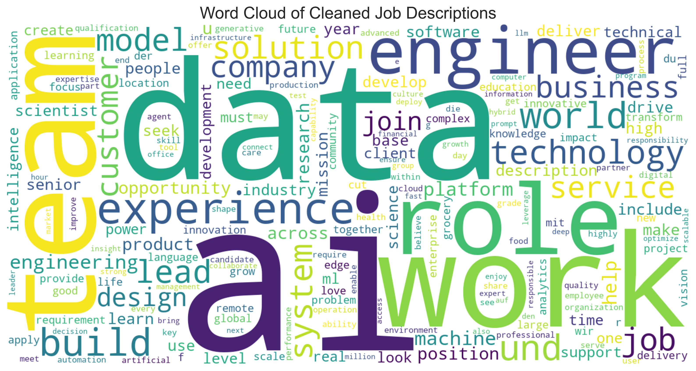
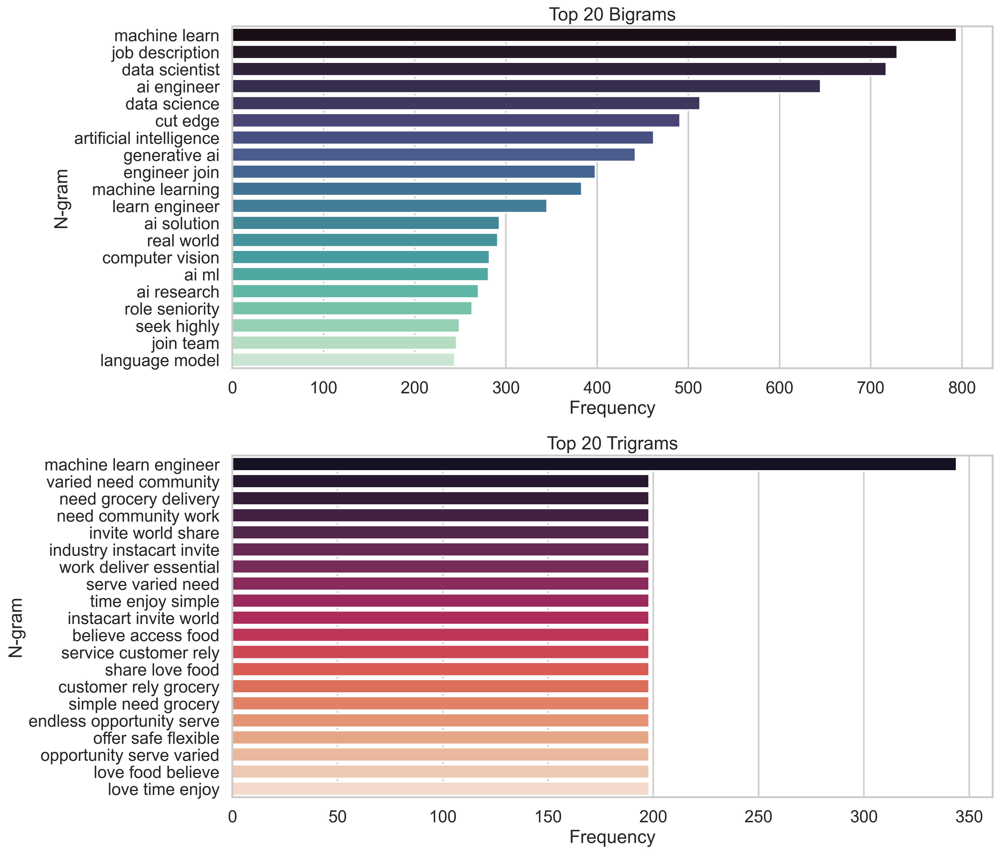
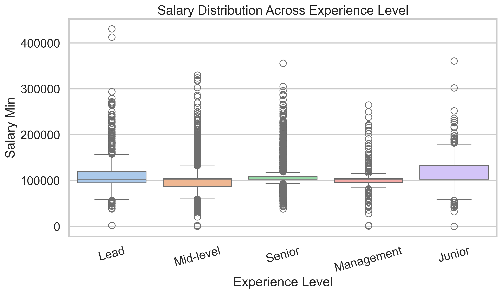
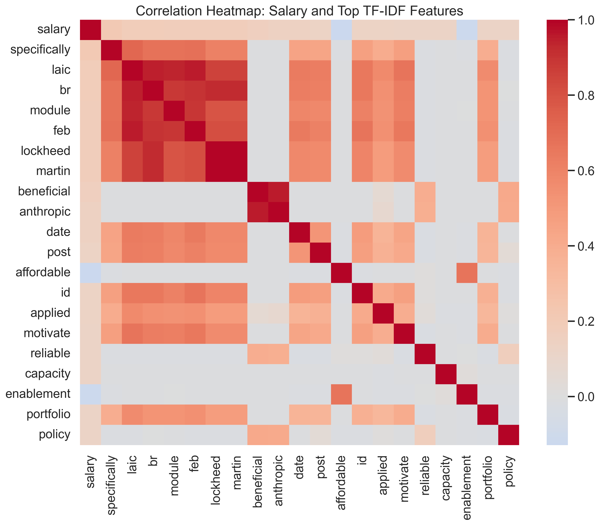
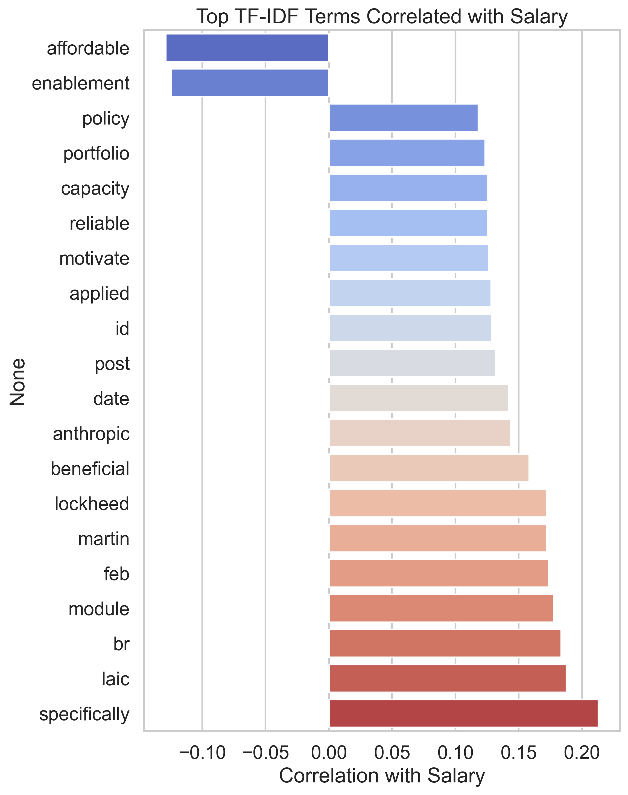

# Mapping Technical Skills in AI/ML Job Markets: A Descriptive Text Analytics Study

## Abstract

This repository contains a reproducible Python-based analysis of 5,773 AI/ML job postings (2026). Using a focused NLP pipeline and TF‑IDF feature extraction, the study maps technical skill mentions in job descriptions and quantifies their relationship with reported salaries. The goal is to identify skill clusters and highlight terms associated with salary premiums.

## Project Overview

- Dataset: 5,773 consolidated AI/ML job postings (processed).
- Original dataset source: [AI Job Market — Global 2026 (Kaggle)](https://www.kaggle.com/datasets/atharvasoundankar/ai-job-market-global-2026)
- Cleaned dataset (produced by this pipeline): [output/ai_jobs_global_2026_cleaned.csv](output/ai_jobs_global_2026_cleaned.csv)
- Objective: identify technical skill clusters from unstructured job descriptions and measure correlations between specific skills/terms and salary.

## Technical Stack

- Language: Python
- Data wrangling: `pandas`
- NLP / Lemmatization: `nltk` (tokenization, stopwords, WordNet lemmatizer)
- Vectorization & modeling: `scikit-learn` (`TfidfVectorizer`)
- Visualization: `matplotlib`, `seaborn`, `wordcloud`
- Execution: Jupyter Notebook (`load_clean_ai_jobs_2026.ipynb`)

## Key Features & Pipeline

The analysis follows a clear, reproducible pipeline:

1. Data ingestion and cleaning
  - Parse and normalize salary fields, convert to numeric types.
  - Create a unified `salary` column (row-wise mean of `salary_min`/`salary_max` when present).
  - Impute missing `salary` values with the dataset median and backfill `salary_min`/`salary_max` from `salary`.

2. Automated text preprocessing
  - Lowercasing, HTML and punctuation stripping
  - Tokenization using regex-based tokenizer
  - Stopword removal (NLTK English stopword list)
  - POS-aware lemmatization via NLTK WordNet lemmatizer

3. Feature extraction
  - TF‑IDF vectorization (unigrams & bigrams; `max_features` configurable)
  - Derive term-level statistics and compute Pearson correlations with `salary`

4. Statistical & visual analysis
  - Compute distributional statistics (skewness, kurtosis) for salary and selected features
  - Visualize top n-grams, word cloud, salary boxplots (by experience/role), TF‑IDF heatmap, and top correlated terms

## Visualizations (placeholders)

Below are representative figures produced by the notebook. Replace the paths if you move outputs.

- Word cloud: 
- Top n‑grams bar chart: 
- Salary vs Experience boxplot: 
- TF‑IDF → Salary correlation heatmap: 
- Top correlated TF‑IDF terms (bar chart): 

## Key Findings (high-level)

- The cleaned dataset contains 5,773 usable job postings for analysis.
- Several terms and skills exhibit strong positive correlations with salary; in this analysis, terms such as **PyTorch**, **RAG** (Retrieval-Augmented Generation), and **LLM** (Large Language Models) consistently associate with salary premiums.
- Correlation results are exploratory and should be interpreted cautiously — they flag candidate skills for further multivariate analysis.

## How to Run (quick start)

Clone the repository, create a virtual environment, install dependencies, and run the notebook. Example (Windows / PowerShell):

```bash
git clone <your-repo-url>
cd <repo-folder>
python -m venv .venv
.\.venv\Scripts\Activate.ps1
pip install -r requirements.txt
# Run interactively
jupyter lab
# or run end-to-end (recreates outputs)
jupyter nbconvert --to notebook --execute load_clean_ai_jobs_2026.ipynb --ExecutePreprocessor.timeout=600
```

Notes:
- If the raw data cannot be shared publicly, use the notebook's data-acquisition steps or provide only the cleaned `output/` artifacts.

## Repository Structure

- [load_clean_ai_jobs_2026.ipynb](load_clean_ai_jobs_2026.ipynb) — primary analysis notebook (Load → Clean → TF‑IDF → Analysis → Visuals)
- [output/ai_jobs_global_2026_cleaned.csv](output/ai_jobs_global_2026_cleaned.csv) — cleaned dataset
- `output/` — generated figures and charts (see placeholders above)
- [requirements.txt](requirements.txt) — pinned dependencies for reproducibility

## Reproducibility & Notes on Environment

- The analysis was executed in a Python virtual environment. Use the provided `requirements.txt` to recreate the environment.
- For long-running cells, increase `--ExecutePreprocessor.timeout` or run the notebook interactively.

## Limitations, Ethics & Next Steps

- The correlation analysis is univariate and does not control for confounders such as geographic location, seniority, or company size. Use multivariate regression or causal methods for stronger claims.
- The dataset may contain bias due to sampling, posting practices, or regional salary scales; interpret results with caution.
- Before publishing, verify dataset licensing and remove any sensitive or proprietary records.

Recommended follow-ups:
- run multivariate models controlling for confounders (location, years experience)
- cluster job descriptions to identify coherent skill groups
- produce an interactive dashboard for exploration

## License & Contact

This repository is provided for educational purposes. If you plan to publish publicly, add a `LICENSE` (e.g., MIT) to this repository.

Contact: andyderis36@gmail.com

---

Short repository description (for GitHub metadata):
Mapping Technical Skills in AI/ML Job Markets — descriptive text analytics of 5,773 2026 job postings; TF‑IDF, correlations, and visualizations.

If you want, I can next:
- add an MIT `LICENSE` file,
- strip outputs and clear metadata from `load_clean_ai_jobs_2026.ipynb` before commit, or
- create a short GitHub project description and topics/slug for publishing.

